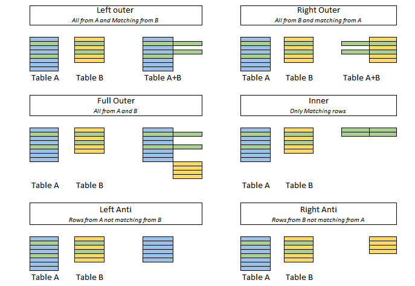

# How to Do Vibe Coding with Cline



A practical guide to pairing with Cline: plan before act, use the right models for each phase, codify your workflow as rules, and feed the assistant the context it needs via MCP servers.

---

## What is “Vibe Coding” with Cline?

Vibe Coding is a tight feedback loop with an AI pair that:
1) explores and plans with you, 2) executes small, safe steps, 3) verifies results, and 4) iterates quickly.  
Cline supports this with two distinct modes:
- Plan Mode: discuss, read/search code, design a concrete plan.
- Act Mode: apply precise, tool-driven edits with verification between steps.

---

## The Plan → Act Loop

1) Plan (Reasoning model)
- Explore: Read key files, search for symbols, list definitions.
- Decide: Architecture sketch, API touch points, acceptance tests.
- Limit scope: Define the minimal viable change for one iteration.
- Produce a checklist the Act phase can follow.

2) Act (Accurate coding model)
- Execute one tool-guided step at a time (edit, run, test).
- Wait for confirmation or adjust on errors.
- Keep changes small; prefer targeted edits over large rewrites.

Example planning checklist:
- [ ] Identify target files (components, routes, tests)
- [ ] Confirm existing helpers/utilities
- [ ] Draft exact code edits and where they apply
- [ ] Define test/verification steps
- [ ] Update docs after implementation

---

## Model Selection Strategy

- Planning: Use a reasoning-capable model to handle ambiguity, alternatives, and trade-offs.
- Acting: Use a reliable, accurate coding model to produce deterministic edits and follow rules precisely.

This split improves both quality (better designs) and reliability (fewer tool mishaps).

---

## Prompting: Make It Specific

A good prompt has:
- Objective: What outcome you want, with business/user impact.
- Inputs/Outputs: Files, endpoints, or data structures in scope.
- Constraints: Performance, security, backward compatibility, style guides.
- Tool Use Boundaries: Which tools to use and in what order.
- Acceptance Criteria: What “done” looks like (tests pass, UI renders, logs are clean).
- Change Management: Remind to update docs and follow Rules.

Planning prompt template:

```text
You are in Plan Mode. Produce a concrete plan and a short checklist.
Objective: <what we want and why>
Scope: <files, APIs, modules in play>
Constraints: <perf, security, style, compatibility>
Context Available: <MCP servers/resources to consult>
Deliverables for Act: 
- Exact file paths and edits
- Test steps and expected outputs
- Docs to update
Use reasoning to compare 2–3 approaches briefly, then pick one and output a checklist suited for tool execution.
```

Act prompt template:

```text
You are in Act Mode. Execute the approved checklist step-by-step.
Rules to follow: <paste Cline Rules>
Tools allowed: <read/search/edit/build/test/browser as applicable>
For each step:
- Use the minimal tool call to progress
- Wait for confirmation/errors after each tool
- Keep diffs small and targeted
- Update docs at the end
Stop when acceptance criteria are met.
```

---

## Cline Rules: Codify Your Workflow

Copy and adapt these Rules to your workspace:

```yaml
rules:
  - Prefer Plan before Act: produce a concrete, verifiable plan with a checklist.
  - Search before create: 
      description: Always check for existing helpers/services/types before adding new ones.
      steps:
        - search_files for function/class/name first
        - read_file candidates before writing new code
  - Targeted edits:
      description: Keep changes minimal and localized.
      guidelines:
        - Prefer replace_in_file for small changes (multiple SEARCH/REPLACE blocks in one call)
        - Use write_to_file only for new files or total rewrites
  - Documentation required:
      description: Create or update docs after changes.
      includes:
        - README sections, ADRs, or docs/*.md
        - Code comments for non-obvious decisions
  - MCP-first context:
      description: Use MCP servers as sources of truth.
      servers:
        - context7: library/docs lookup
        - services-catalog: microservices, APIs, versions, auth, SLAs
      policy:
        - Never hardcode service endpoints; resolve via services-catalog
        - Verify version/contract before calling a service
  - Safety and verification:
      - After edits, run linters/tests or open a local page to verify
      - If errors occur, stop and adjust the plan
  - Scope limits:
      - Do not attempt full-repo migrations in one pass
      - Chunk large refactors into feature-based iterations
```

You can store these in a team-visible doc or paste as part of your Plan → Act prompts.

---

## Feeding Context via MCP Servers

Cline gets powerful when it can pull external context at runtime. Two common sources:

1) Context7 MCP (docs, libraries, code refs)
- Resolve a library/API by name, then fetch scoped docs.
- Great for public libs or internal docs hosted in Context7.

Example flow:
```text
- resolve-library-id: "your-internal-auth-lib"
- get-library-docs: focus on "client initialization" and "token refresh"
- Extract exact init sequence and error handling patterns
```

2) Your Services Catalog MCP
- Centralized registry of microservices, endpoints, versions, OpenAPI schemas, auth requirements, and SLOs.
- All microservice information can be found in this MCP server; treat it as the single source of truth.

Example Rules snippet:
```yaml
rules:
  - All microservices info is authoritative in MCP "services-catalog".
  - Before using a service:
      - Resolve service by domain/tag
      - Confirm current version and deprecation notices
      - Pull request/response schemas (OpenAPI) and auth scopes
```

With these in place, Cline can decide which microservice to call, how to authenticate, and which DTOs to use—without guesswork.

---

## End-to-End Example (Condensed)

Goal: Add “Reset Password” flow to the Account UI.

Plan (Reasoning model):
- Explore: search_files for existing auth helpers; read current login component and routes.
- Decide: Use existing `requestPasswordReset(email)` in `auth-service` if available.
- Checklist for Act:
  - [ ] Confirm helper exists; otherwise plan minimal new function in auth client
  - [ ] Add UI entry point (button/link) and route/page
  - [ ] Wire form submit → service call with success/error states
  - [ ] Add a test or manual verification steps
  - [ ] Update docs: README “Auth flows” section

Act (Accurate coding model):
- Resolve auth API details from services-catalog MCP (endpoint, schema, errors)
- If helper exists, reuse; else add a small, typed wrapper
- Edit UI files with targeted replace_in_file calls
- Run local app and verify success message + console/logs clean
- Update README with new flow and any env vars

---

## Limitations and Scope

- Context is the big constraint. Don’t expect the assistant to ingest an entire repository and complete a migration autonomously.
- Instead, slice the work: one feature, subsystem, or directory at a time, with crisp acceptance criteria.
- We’ll cover migration patterns (indexing, ADRs, chunking, validation gates) in a dedicated blog—stay tuned.

---

## A Minimal “Vibe” Checklist for Your Next Task

- [ ] Plan in reasoning model, produce a concrete checklist
- [ ] Confirm existing helpers before adding new code
- [ ] Fetch APIs and contracts via MCP (Context7, services-catalog)
- [ ] Execute small, verifiable edits in Act mode
- [ ] Run tests or manual checks; fix errors immediately
- [ ] Update docs (README/ADRs) and add comments where needed

By separating planning and execution, codifying your rules, and feeding the right context, Cline becomes a dependable pair for shipping high-quality changes—fast.
